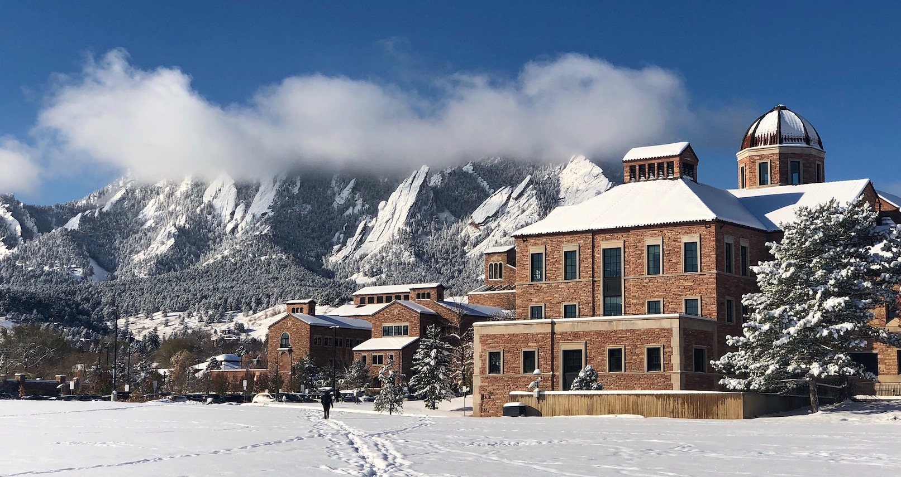
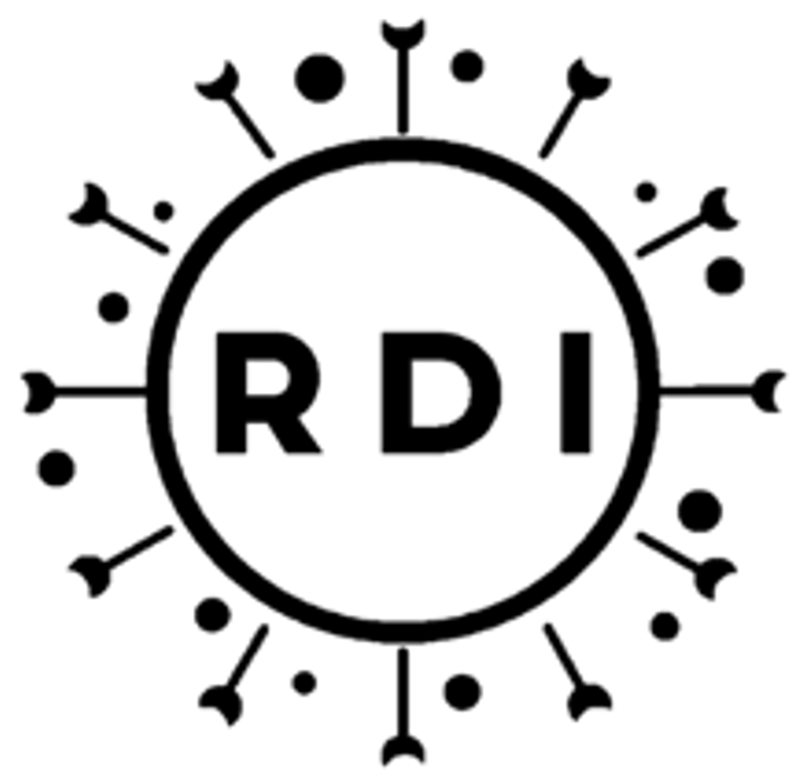
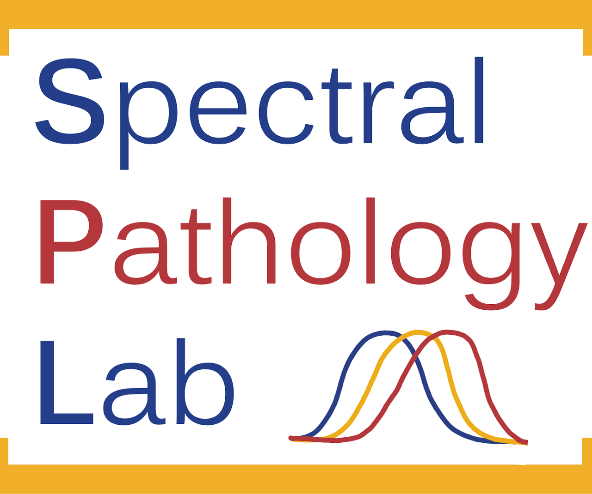
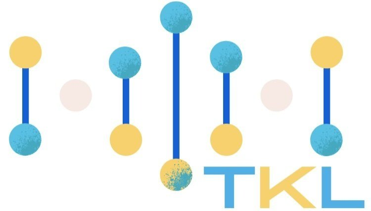

# Heyo! Welcome to Zachary Caterer's github profile. 

## Graduate Education
- I am a graduate student at the [University of Colorado Boulder](https://www.colorado.edu/) studying [Biological Engineering](https://www.colorado.edu/chbe/apply/graduate-program/biological-engineering-phd-program) in the [Interdisciplinary Quantitative Biology Program](https://www.colorado.edu/certificate/iqbiology/).  

- As a graduate student I have rotated in research labs of the [Zhang lab](https://fanzhanglab.org/) at [CU Anschutz School of Medicine Division of Rheumatology](https://medschool.cuanschutz.edu/rheumatology), and the [Stanislawski Lab](https://medschool.cuanschutz.edu/dbmi/lab-pages/stanislawski-lab) at [CU Anschutz School of Medicine Department of Biomedical Informatics](https://medschool.cuanschutz.edu/dbmi), [Rationally designed immunotherapeutics & INTERFACEs research group](https://www.sprengergroup.com/) at [CU Boulder Department of Chemical and Biological Engineering](https://www.colorado.edu/chbe/). 

  
  
  

## Undergraduate Education
- I obtained my baccalaureate degrees from the [University of Wisconsin - Eau Claire](https://www.uwec.edu/), in [Biochemistry, Molecular Biology](https://www.uwec.edu/academics/programs/undergraduate/biochemistry-molecular-biology/), and [Applied Mathematics, and Statistics](https://www.uwec.edu/academics/programs/undergraduate/statistics-applied-mathematics/).

- As an Undergraduate researcher in the [Wheeler Lab](https://wheelerlab.bio/) and the [Gomes Lab](https://www.uwec.edu/profiles/gomesr/) at the [University of Wisconsin - Eau Claire](https://www.uwec.edu/), the [Spectral Pathology Lab](https://www.spectralpathology.com/home) at [New York Institute of Technology](https://www.nyit.edu/), and [The Kamariza Lab](https://www.kamarizalab.com/) at the [University of California Los Angeles](https://www.ucla.edu/). 

  
  
  
  

### Wheeler Lab Project
In the Wheeler Lab, I worked on developing a Graphical User Interface (GUI) for the software [wrmXpress](https://github.com/zamanianlab/wrmXpress), which is used for the high-throughput analysis of parasites. This project is implementing the use of the Python library Dash, allowing the user to create necessary files and conduct the analysis all in a single platform. The GUI code can be found here: [wrmXpress-gui](https://github.com/wheelerlab-uwec/wrmXpress-gui).

### Gomes Lab Project
In the Gomes Lab, I worked on developing methods implementing the use of feature selection, machine learning, and deep learning pipelines for the detection/identification of markers of Pancreatic Ductal Adrenal Carcinoma (PDAC) using DNA Methylation and RNA sequencing datasets. Additionally I played a major role in developing deep learning pipelines for FTIR for renal biopsies of malignant and begnin tumors. The code for this project and paper can be found here: [AI-Bioimaging](https://github.com/caterer-z-t/AI-Bioimaging)

### Resume
- [Curriculum Vitae](assets/zc_cv_a.pdf)

### Connect with me:
  
- My email is hyperlinked in my CV

### Tech Stack:
                                    
<!--
# 📊 GitHub Stats:
 
 

## 🏆 GitHub Trophies

### ✍️ Random Dev Quote

### 🔝 Top Contributed Repo

### 😂 Random Dev Meme

-->

<!-- Proudly created with GPRM ( https://gprm.itsvg.in ) -->
